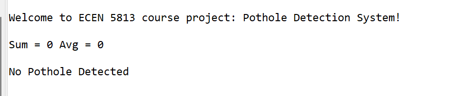
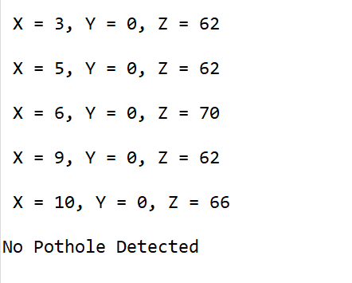
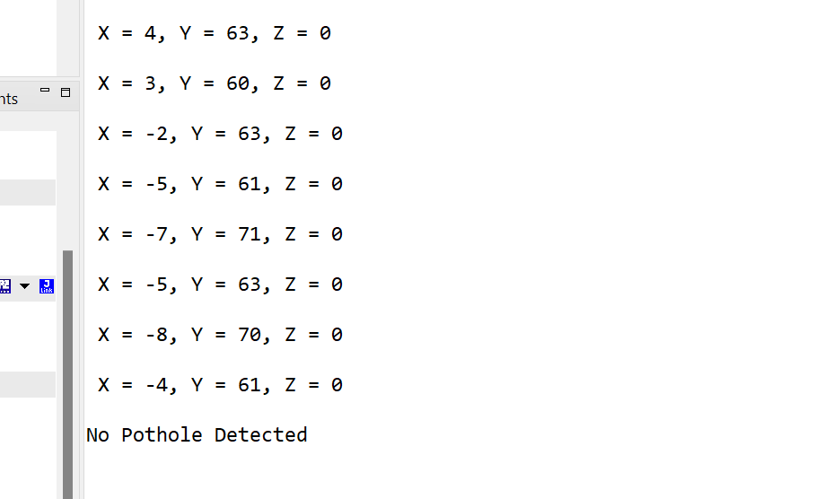
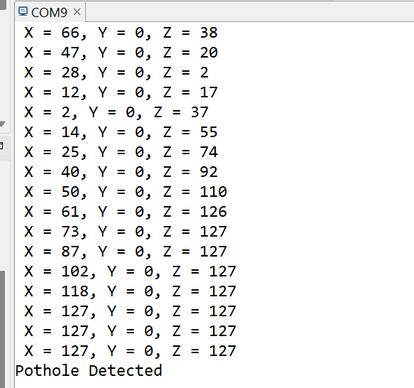
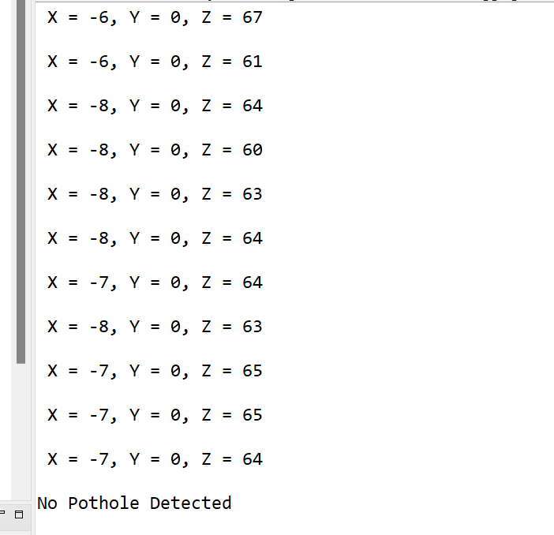
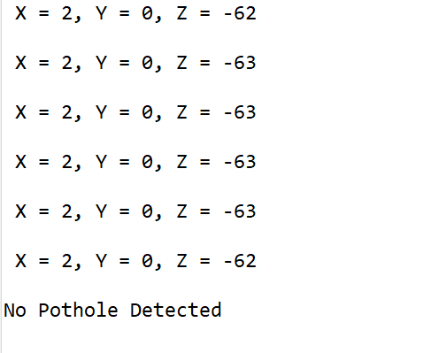

# Pothole Detection System

## PES (ECEN-5813) Course Project

This repository contains the project setup for PES (ECEN-5813) course project - Pothole Detection System. 
The project contains DEBUG target which ineterfaces an accelerometer available on FRDM-KL25Z board to detect the potholes on the road.

## Project Overview

This project implements a Pothole detection System that will detect the potholes and irregularities on the roads using sensor data. This system can be highly useful for the maintenance of road infrastructure.

## Objectives
* To develop an algorithm to detect the irregularities in the road surface based on the accelerometer data of a moving car.
* To interface MMA8451Q (3-axis accelerometer) present on FRDM-KL25Z board with I2C to measure the movement across Z-axis.

## Block Diagram
![Block_diagram][Block_diagram]

## Pothole Detection Algorithm
* Curcular buffer is filled with the output values from the accelerometer measured across z-axis movement.
* When the buffer is fully filled to it's capacity then the computation starts.
* There are two methods of computing the pothole detection:
  1. Method 1: * Calculate the PT1 low-pass filter value with buffer value.
               * Calulate the average of the difference of the filter value and the original value.
  2. Method 2: * Counting how many number of times the buffer values exceed the given threshold value.
* Combining the method 1 and method 2, if the average value is greater than given threshold 1 (method 1) and counted value is greater than threshold 2 (method 2), only then the pothole is detected.
* Output values and the pothole detection decision is displayed via UART
* When the pothole is detected the LED on the board will be on for RED.
* When there's no pothole the LED will remain off.
* Buffer is cleared once the computation is done and then it takes for the next set of accelerometer values.
* Simuteneously, the python script will be run on the system which will read all the data from UART and save it to the log file.

## Hardware Requirements & Specifications
* Dev. board: FRDM-KL25Z
* Accelerometer: MMA8451Q (On-board FRDM-KL25Z)
* USB connector for a dev board

## Sofware Modules
* PES_Final_Project.c : Main file, Application entry point
* cbfifo.c/.h         : Contains the fuctions for circular buffer implementations and Pothole functions and also filter function for PT1.
* mma8451.c/.h        : Contains the configuration of accelerometer; A function that reads the data for the 3-axis acceleration using the I2C.
* i2c.c/.h            : Contains the configuration of I2C present on KL25Z for port-0. Contains the functions for data write, read operations.
* LED.c/.h            : Contains the configuration for LEDs and LED on/off functions, which is used to detect the pothole.
* delay.c/.h          : Contains a delay function

## UART Terminal Configuration
![UART_Configuration][UART_Configuration]

## Manual Test Routine
1. Test 1:
  When the board is kept stable, 
  Output: initial values of X, Y, Z from the accelerometer will be displayed on the UART, No pothole, LED OFF
   Screenshot:  
   
  

2. Test 2:
Move the board forward and backward in X- direction
Output: No pothole, LED off
   Screenshot:  
   
   

Test 3:
Move the board up side wise (forward, backword) in Y-direction
Ouput: No pothole, LED OFF
   Screenshot:  
   
   

Test 4:
Move the board up and down (rapidly, as a jerk) in Z-direction
Ouput: Pothole detected, RED LED ON
   Screenshot:  
   
   

Test 5:
Moving the board gradually in the upward slope (Movement in X and Z axis)
Ouput: No pothole, LED OFF
   Screenshot:  
   
   

Test 6:
Moving the board gradually in the downward slope (Movement in X and Z axis)
Ouput: No pothole, LED OFF
   Screenshot:  
   
  

## Project Demo
Please click on the following link to watch the project demo video:
(Insert link)

## Learnings 
* Learnt to configure different hardware modules present on FRDM KL25Z like - Accelerometer, I2c, LEDs
* Learnt how I2c protocol works.
* Explored accelerometer present on the FRDM KL25Z
* UART communication
* While woeking on this project I could experience the complete software development cycle phases right from requirement analysis to the system testing.

## Challanges Faced
* I faced some challanges while deciding the threshold value for the pothole detection.
* Since this is a prototype model, configuring the system to real time scenario was kind of difficult.
* Initially by just using the threshold and mod values, It was giving pothole detection in case of inclination as well, I resolved this issue by using filter.
* Implementation of high pass filter was computetionally expensive and complex, hence I used a PT1 low-pass filter and calculated the deviation of the original and the filter output. This approach eliminated the false detection and also solved the initial calibration issues.
